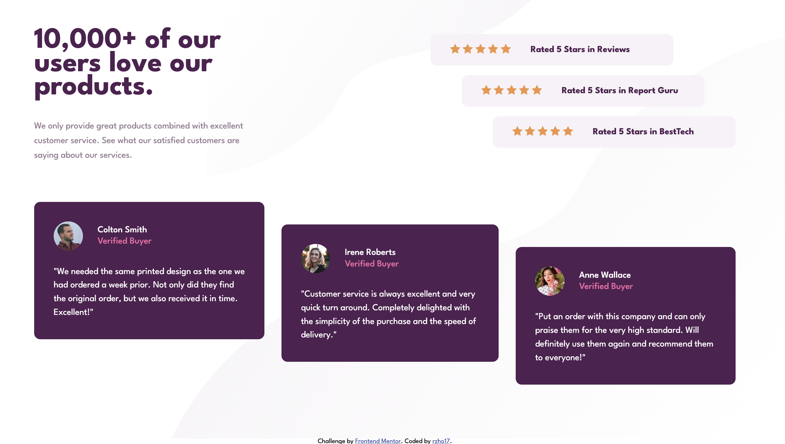

# Frontend Mentor - Social proof section solution

This is a solution to the [Social proof section challenge on Frontend Mentor](https://www.frontendmentor.io/challenges/social-proof-section-6e0qTv_bA). Frontend Mentor challenges help you improve your coding skills by building realistic projects.

## Table of contents

- [Overview](#overview)
  - [Screenshot](#screenshot)
  - [Links](#links)
- [My process](#my-process)
  - [Built with](#built-with)
  - [What I learned](#what-i-learned)
  - [Continued development](#continued-development)
- [Author](#author)
- [Acknowledgments](#acknowledgments)

## Overview

This is my version of the social proof section challenge.

### Screenshot

### Links

- Solution URL: [Here](https://github.com/rzho17/results-summary-component-main)
- Live Site URL: [Here](https://rzho17.github.io/FEM-social-proof-section/)

## My process

I started by designing the mobile design first and added any remaing divs / styles needed to complete the project

### Built with

- Semantic HTML5 markup
- CSS custom properties
- Mobile first work-flow
- Flexbox

### What I learned

I experimented by trying not to set any widths for certain elements. My goal was to try to achieve a flexible design that would work on both mobile and desktop.

### Continued development

I still need to learn more about sizing in CSS. I feel whenever I try to do something it never works how I want it to. I feel it's because I don't fully understand what I am doing sometimes so I have to resort to adjusting things by adding margin or padding when there are already capable tools to achieve what I want.

## Author

- Github - [Here](https://github.com/rzho17)
- Frontend Mentor - [@rzho17](https://www.frontendmentor.io/profile/rzho17)
